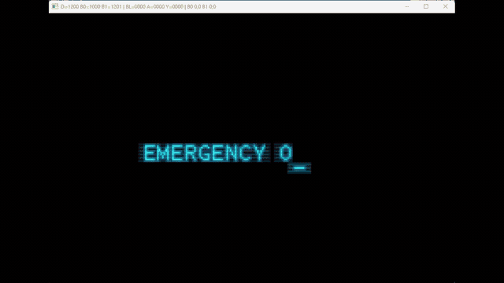

# MZM: Reprimed

A native PC port of **Metroid: Zero Mission**.
This project is currently an early proof of concept.


> Early development footage — work in progress.

## Current status

- Runs as a native Windows executable
- Initializes the original game logic
- Implements keyboard input
- Implements GBA memory/register compatibility layers
- Implements native DMA and BIOS decompression replacements
- Loads required game data from a user-supplied ROM
- Runs the opening intro sequence
- Renders the intro's sprite graphics through a native software renderer

This is **not yet a complete playable port**. Rendering, audio, game modes, and other GBA hardware functionality are still being implemented.

## Requirements

- 64-bit Windows
- A legally obtained US copy of Metroid: Zero Mission for Game Boy Advance

The ROM is **not included** with this project.

Launch `mzm_pc.exe` and select your ROM when prompted.
The currently supported ROM is identified by:

```text
SHA-1: 5de8536afe1f0078ee6fe1089f890e8c7aa0a6e8
Size:  8388608 bytes
```

### Controls

- Arrow keys — D-Pad
- X — A
- Z — B
- Enter — Start
- Backspace — Select
- A — L
- S — R
